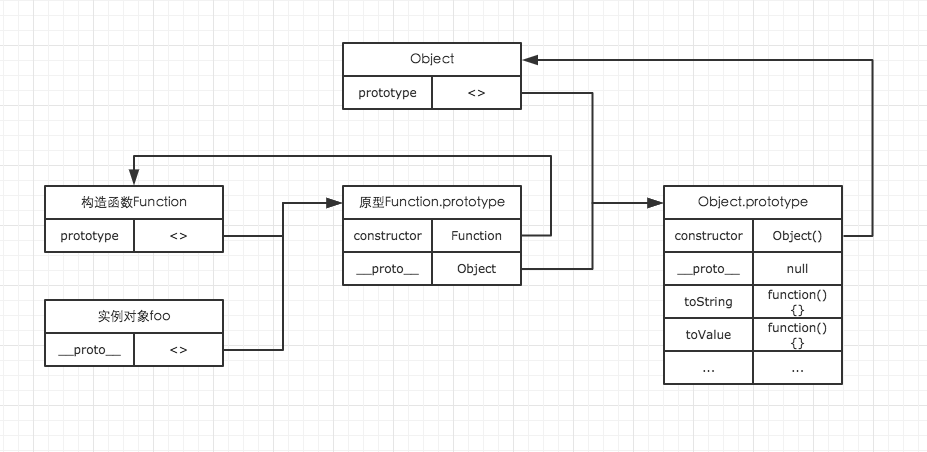

# JavaScript

## 构造函数、面向对象、原型、原型链

## 工厂模式
>顾名思义，工厂模式就是提供一个模子，然后通过这个模子复制出我们需要的对象。

>解决重复代码
```javascript
//建立个模子
var createPerson = function (name,age){
    var o = {};
    o.name = name;
    o.age = age;
    o.getName = function(){
        return this.name;
    }
    return o;
}
//根据模子创建实例
var person1 = createPerson('aa',24);
var person2 = createPerson('bb',25);

//通过instanceof 识别对象的类型
var obj = {};
(obj instanceof Object)   //true
```


## this
>this的指向是在调用时确定的。

>在一个函数上下文中，this由调用者提供，由调用函数的方式来决定。如果调用者函数，被某一个对象所拥有，那么该函数在调用时，内部的this指向该对象。如果函数独立调用，那么该函数内部的this，则指向undefined。但是在非严格模式中，当this指向undefined时，它会被自动指向全局对象。

### 作为方法调用
```javascript
//例子1
var name="XL";
var person={
    name:"xl",
    showName:function(){
        console.log(this.name);
    }
}
person.showName();//xl  --因为person去调用showName所以this指向person

var showNameA=person.showName;
showNameA();   //XL --因为是showNameA去调用showName的,showNameA是在window下 所以this指向window 

//例子2
var personA={
    name:'XL',
    showNameA:function(){
        console.log(this.name);
    }
}

var personB={
    name:'xl',
    showNameB:personA.showNameA
}
personB.showNameB();
//xl --因为showNameA是在personB中进行调用的所以this指向的是personB

```


### 作为构造函数调用
```javascript
var name ="XL"
function  Person(name){
    this.name='xl';
}
var personA=Person();
// console.log(window.name);//xl
// console.log(personA.name)//报错
//当personA去调用Person()指向的是window所以this.name就是window.name，重新赋值了name=xl而不是XL

var personB=new Person();
console.log(personB.name);//xl
//new操作符会实例化对象。

```
### new操作符
>先创建一个空对象o，将o的原型链继承fn的原型
>用`call`或`apply`把fn的this重新指向为o,即完成o.name=name操作

```
new操作符调用构造函数会经历4个阶段
1.创建一个新对象。
2.将新对象的原型执行构造函数的原型
3.将构造函数的this指向这个新对象 指向构造函数的代码，为这个对象添加属性，方法
4.返回新对象
```

```javascript
//模拟new操作符
function newperson(fn,arg){
    var o = {};
    o.__proto__=fn.prototype
    fn.call(o,arg);
    return o;
}
var name = "XL"
function  Person(name){
    this.name = 'xl';
}
var p = newperson(Person);
console.log(p.name);//xl
```

### call/apply方法
>用处：主要用来改变`this`的指向<br>
>区别：`call`是一个一个的传递，`apply`是以数组形式传递

```javascript
 var name = 'XL';
  var person = {
      name:"xl",
      changeName:function(){
          console.log(this.name)
      }
  }
 var p = person.changeName;
 p();//XL  全局window下
 p.call(person)//xl  this重新指向为person
```


>超时调用的代码`setTimeout`和`setInnerval`都是在`window`下运行。非严格模式指向的是window，严格模式下指向undefined；
```javascript
function newbind (fn,obj){
    return fn.apply(obj,arguments);
}

var a = 10;
var obj = {
    a: 20,
    getA: function() {
        setTimeout(newbind(function() {
            console.log(this.a)
        },this), 1000)
    }
}

obj.getA();//10

//newbind通过apply吧this指向obj。输出10;
```

通过apply\call实现继承
```javascript
var father = function(work,sex){
    this.work = work;
    this.sex = sex;
    this.hello = function(){
        console.log(this.work,this.sex,"hello");
    }
}
var son = function(name,sex,height){
    father.apply(this,arguments);
    this.height=height;
}

son.prototype.message = function(){
    console.log(this.work,this.sex,this.height);
}

var son = new son('zz','man',180);
son.message();//zz man 180
son.hello();//zz man hello

```
<b>借助apply方法,将父及的构造函数指向一次，相当于将两father中的代码,在son中复制一份,其中this的指向为son中new出来的实例对象</b>

## 原型
>构造函数的prototype与所有实例对象的`_proto_`都指向原型对象。而原型对象的`constructor`指向构造函数

``` javascript
function Person(name,age){
    this.name = name;
    this.age = age;
}

Person.prototype.getName = function (){
  return this.name;
}

new Person('z',10);
var p1 = new Person("aa",20);
var p2 = new Person("bb",30);
console.log(p1.getName === p2.getName);
```
<br>


### 继承
```javascript
function Person (name,age){
    this.name = name;
    this.age = age;
}

Person.prototype.getName = function () {
    console.log(this.name,this.age,this.height);
}

function son (name,age,height){
    Person.apply(this,arguments);
    this.height = height;
}

var p1 = son.prototype = new Person("aa",1,2)
p1.getName();
```
<b>原型的继承，只需要将子及的原型对象设置为父级的一个实例，加入原型链中</b>
<br>


## 函数参数传递方式:按值传递
>函数参数在进入函数时，实际是被保存在了函数的变量对象中，因此，这个时候发生了一次复制。

传入参数是按值传递，而不是引用传递，只不过传递一个引用类型时，传递的是引用类型保存在变量中的引用（指针）而已。
```javascript
var person = {
    name:'aa'
}
function setName(obj){
    obj = {};//将传入的引用指向另外一个值
    obj.name = 'bb';
}
setName(person);
person.name;//aa
```
如果是引用传递的话name会被改变成bb，在这里将obj的引用执行了一个{}所以obj.name='bb' 是不会影响到person.name的


## 事件循环机制
>javascript 是单线程，线程中唯一一个事件循环
### 队列数据结构
>在javascript代码执行过程中，除了依靠函数调用栈来决定函数的顺序，另外还依靠任务队列  `先进先出（FIFO）` ;

>执行顺序：从script开始第次一循环，之后全局上下文进入函数调用栈，直到调用栈清清空（只剩下全局），然后执行所有的micro-task，所有都执行完毕后，循环再从macro-task开始，其中一个任务队列执行完毕，然后在执行所有的micro-task。这样一直循环下去。

```
 1.所有同步任务都在主线程上执行，形成一个执行栈
 2.主线程之外，还有一个“任务队列”。只要异步任务有了运行结果，就在任务队列中放置一个事件
 3.一旦执行栈中的所有同步任务执行完毕，系统就会读取任务栈，找到对应的异步任务，结束等待状态，进入执行栈，开始执行。

 主线程不断重复上面的三步骤。
```

<b>事件和回调：</b>
```
任务队列是一个事件的队列，IO设备（键盘打印机…）完成一项任务，就在队列中添加一个事件，表示异步任务可以进入执行栈中了。主线程就是读取任务队列中的事件，推送到执行栈中执行。

IO设备和用户参数的操作如如点击鼠标，页面滚动，只要指定回调函数，这些事件发生就会进入任务队列，等待主线程的读取。

回调函数，就是那些被主线程挂起来的代码，异步任务必须指定回调函数，当主线程开始执行异步任务，就是执行对应的回调函数。

在前面的事件优先被主线程读取，主线程读取过程基本是自动的，只要执行栈一清空，任务队列上第一个事件自动进入主线程，定时器功能主线程是检查下执行事件，到了规定时间，才返回到主线程。

```


<b>每个任务的执行，无论是macro-task还是micro-task，都是借助函数调用栈来完成的</b>

`macro-task 宏任务--script整体代码、settimeout、setinterval……`
`micro-task 微任务--process.nextTick、Promoise……`

<br>


```javascript
setTimeout(function() {
    console.log('timeout1');
})

new Promise(function(resolve) {
    console.log('promise1');
    for(var i = 0; i < 1000; i++) {
        i == 99 && resolve();
    }
    console.log('promise2');
}).then(function() {
    console.log('then1');
})
console.log('global1');

// promise1 promise2  global1  then1 timeout1


console.log('golb1');

setTimeout(function() {
    new Promise(function(resolve) {
        console.log('timeout1_promise');
        resolve();
    }).then(function() {
        console.log('timeout1_then')
    })
})


new Promise(function(resolve) {
    console.log('glob1_promise');
    resolve();
}).then(function() {
    console.log('glob1_then')
})

console.log('golb2');

setTimeout(function() {
    new Promise(function(resolve) {
        console.log('timeout2_promise');
        resolve();
    }).then(function() {
        console.log('timeout2_then')
    })
})

new Promise(function(resolve) {
    console.log('glob2_promise');
    resolve();
}).then(function() {
    console.log('glob2_then')
})


golb1
glob1_promise
golb2
glob2_promise
glob1_then
glob2_then

timeout1_promise
timeout1_then

timeout2_promise
timeout2_then
```


## Promise
>Promise能防止回掉地狱，让代码更加具有可读性和可维护性，将数据请求和数据处理明确的分开来。
```javascript
function fn(num) {
    return new Promise(function(resolve, reject) {
        if (typeof num == 'number') {
            resolve();
        } else {
            reject();
        }
    }).then(function() {
        console.log('number值');
    }, function() {
        console.log('不是number值');
    })
}

fn('hahha');
fn(1234);

//或者不返回then
//在fn('1234').then(res=>{},rej=>{})
```

<b>Promise.all</b>
>当数组所有的Promise对象状态都变成resolved或者rejected的时候，他才会调用then方法。
```javascript
var url = 'json地址';
var url1 = 'json地址';

function renderAll() {
    return Promise.all([getJSON(url), getJSON(url1)]);
}

renderAll().then(function(value) {
    console.log(value);
    //[{json值},{json值}]
})
```

<b>Promise.race</b>
> 当数组中的其中一个变成res或者rej的时候就调用then方法
`{jsons数据}`


